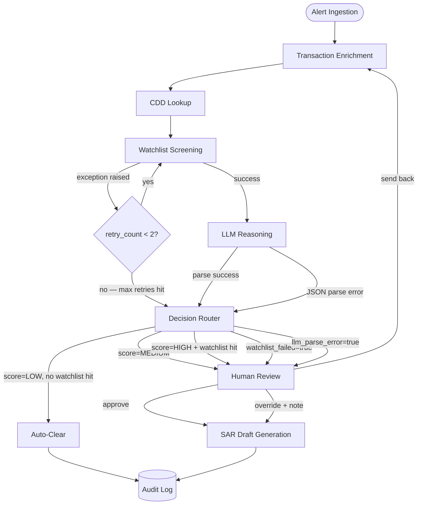
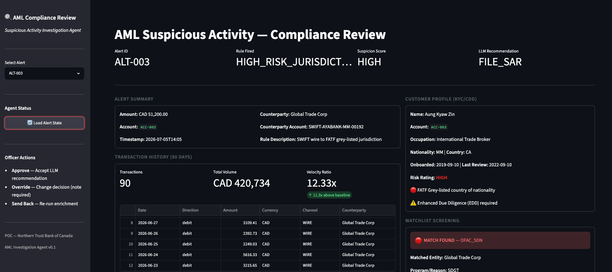
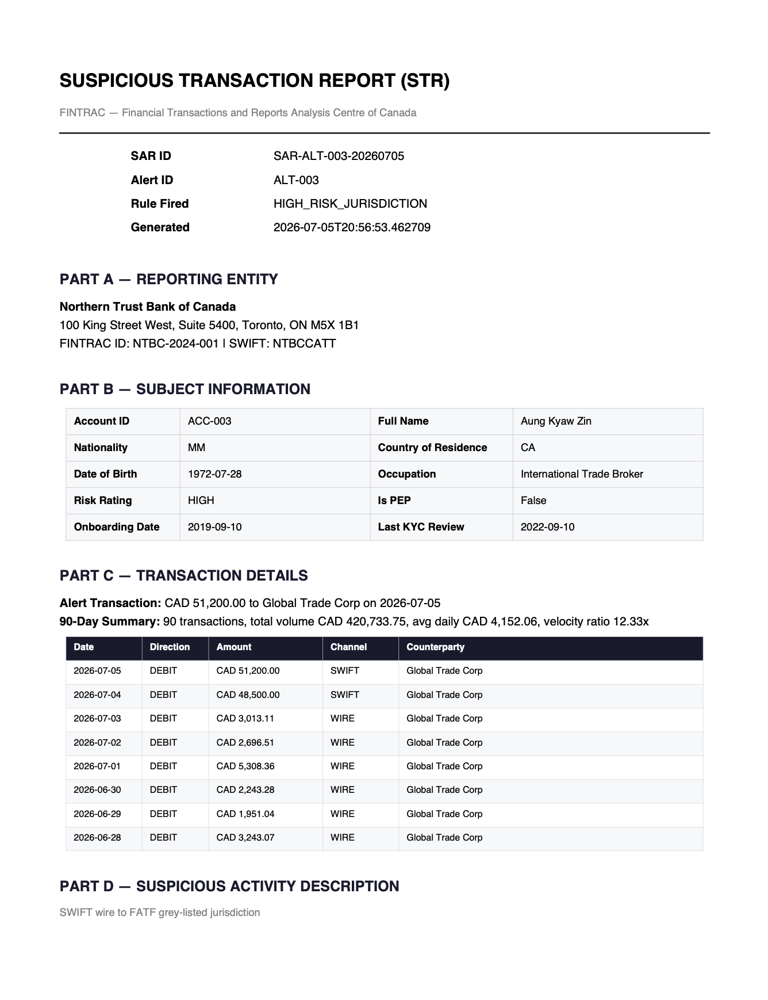
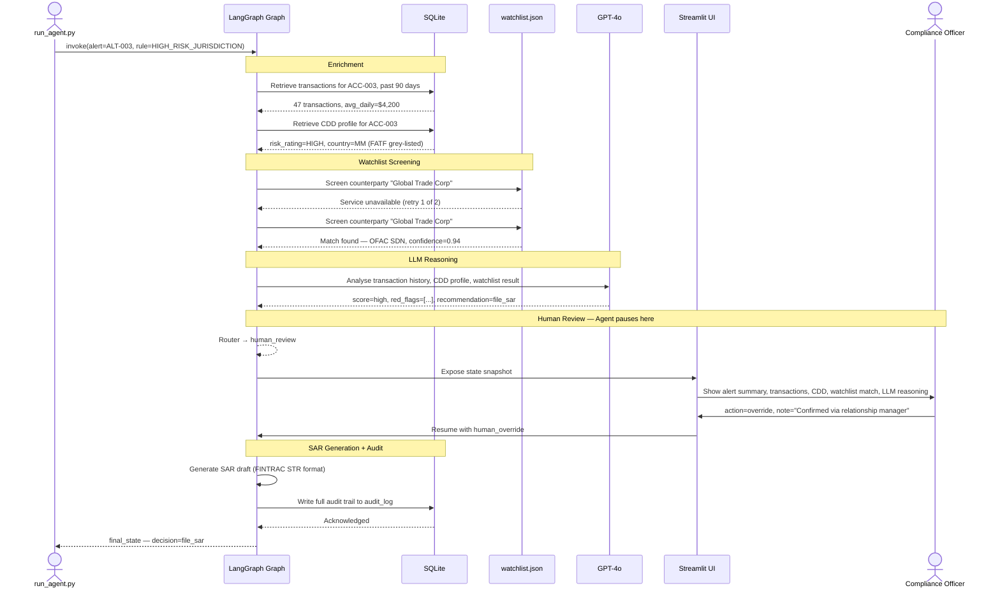
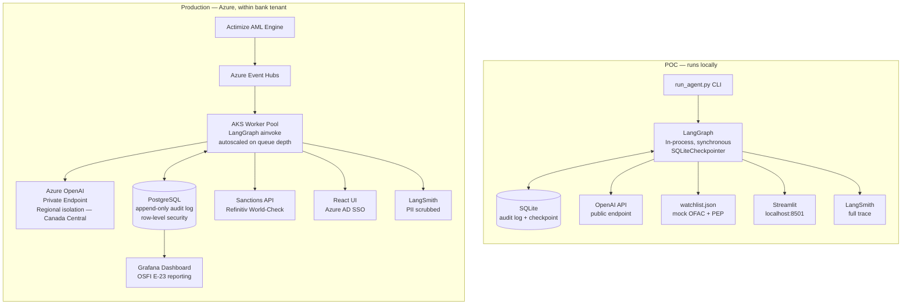
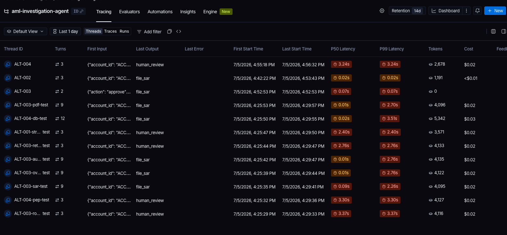

# AML Suspicious Activity Investigation Agent

> An agentic AI system that automates the 2–4 hour manual AML alert investigation down to under 5 minutes — with a mandatory human review checkpoint and a full regulatory audit trail.

---

## Table of Contents

1. [Executive Summary](#executive-summary)
2. [Problem Statement](#problem-statement)
3. [Who This Is For](#who-this-is-for)
4. [What It Solves](#what-it-solves)
5. [Architecture](#architecture)
   - [Agent Graph](#agent-graph)
   - [Sequence Diagram](#sequence-diagram)
   - [POC vs Production](#poc-vs-production)
6. [Tech Stack](#tech-stack)
7. [Why This Stack](#why-this-stack)
8. [OSFI E-23 Alignment](#osfi-e-23-alignment)
9. [Production Considerations](#production-considerations)
10. [Quickstart](#quickstart)
11. [Repository Structure](#repository-structure)
12. [Glossary](#glossary)

---

## Executive Summary

Financial institutions process millions of transactions daily. A small percentage trip AML (Anti-Money Laundering) monitoring rules — but at bank scale, that still means thousands of alerts every day. Today, a compliance analyst manually investigates each one: pulling transaction history, checking KYC profiles, screening watchlists, writing a case narrative, and deciding whether to file a SAR with the regulator. Each investigation takes 2–4 hours.

The real problem is not the volume — it is the false positive rate. Industry research from BCG and Celent shows that **85–99% of AML alerts are false positives**. Analysts spend the majority of their time clearing noise, not catching real financial crime. Fatigue leads to inconsistent decisions. Genuine suspicious activity gets missed.

The regulatory stakes are real. In 2023, FINTRAC fined TD Bank $9.2M CAD for AML program deficiencies. In 2024, TD's US AML failures resulted in a **$3 billion USD penalty** — the largest in US banking history. Canada's OSFI is tightening its own model risk management requirements under **Guideline E-23**, effective May 2027, which mandates documented, auditable, human-overseen AI model decisions.

**This project builds an agentic AI investigation system that automates the 2–4 hour manual investigation down to under 5 minutes.** The agent enriches the alert, screens watchlists, reasons over the evidence using an LLM, and produces a structured SAR draft — then pauses for a human compliance officer to make the final filing decision. Every step is logged for regulatory audit.

This is not a replacement for existing tools like NICE Actimize or Oracle Mantas. It is an intelligence layer that sits on top of them — turning alert volume into a manageable, auditable, consistent workflow.

---

## Problem Statement

### The Current Workflow

When a transaction trips an AML monitoring rule, a human analyst manually:

1. Pulls 90 days of transaction history from core banking systems
2. Looks up the customer's KYC/CDD profile and risk rating
3. Screens the counterparty against OFAC SDN lists, PEP databases, and adverse media sources
4. Reasons over all the evidence and writes a case narrative
5. Decides whether to clear the alert, place the account under monitoring, or file a SAR with FINTRAC

**Time per alert: 2–4 hours.**

### Why This Is Broken

| Problem | Impact |
|---|---|
| 85–99% of alerts are false positives | Analysts waste the majority of their time on noise |
| Manual process is inconsistent | Decision quality varies by analyst experience and fatigue |
| No structured audit trail | Difficult to demonstrate regulatory compliance |
| Alert volume is growing | Real-time payments (RTR in Canada) will increase transaction velocity significantly |
| OSFI E-23 takes effect May 2027 | Banks need documented, auditable AI model governance now |

### The Business Case

- **Analyst productivity:** Reducing investigation time from 2–4 hours to under 5 minutes frees analysts to focus on genuine high-risk cases
- **Consistency:** LLM-driven reasoning applies the same criteria to every alert, every time
- **Regulatory readiness:** Built-in audit trail satisfies OSFI E-23 model lifecycle requirements out of the box
- **Cost:** Estimated $50–100M in analyst time is spent annually on false positives at Big 6 bank scale

---

## Who This Is For

| Audience | What They Get From This Project |
|---|---|
| **Compliance analysts** | A system that pre-investigates each alert so they review a structured summary, not raw data |
| **Compliance officers** | A mandatory human checkpoint before any SAR is filed — with a full audit trail of who decided what and why |
| **Model risk teams** | An AI system designed from the ground up to satisfy OSFI E-23 requirements |
| **Engineering teams** | A reference implementation of a production-grade agentic AI pattern in a regulated context |
| **Regulators / auditors** | An append-only audit log of every decision the system made |

---

## What It Solves

Four specific engineering problems that make this harder than a standard LLM application:

### 1. Retry on Transient Failures
The watchlist screening node calls an external sanctions API (e.g. Refinitiv World-Check). Network calls fail transiently. The agent retries up to twice automatically, then routes to human review with a `watchlist_failed` flag rather than proceeding without a complete screen — which would be a compliance violation.

### 2. Human-in-the-Loop Pause
A compliance officer must review and approve before any SAR is filed. The agent must pause, wait for human input, accept a modified decision, and resume from exactly where it stopped. LangGraph provides a native interrupt/resume mechanism for this pattern. Implementing equivalent behaviour in plain Python requires building a custom async queue, callback handler, and state resumption mechanism from scratch — achievable, but not the core problem this project is trying to solve.

### 3. Crash Recovery via Checkpointing
If the agent process crashes between node 4 and node 5 — mid-investigation — it must resume from that exact point without reprocessing the alert. LangGraph's checkpointer persists state at every node automatically. Without this, a crash restarts the investigation from the beginning, potentially re-calling the LLM, re-screening watchlists, and producing a different result.

### 4. Automatic Audit Trail
OSFI E-23 requires a complete, traceable record of every model decision. LangGraph's state object accumulates data at every node transition. The audit log node writes that accumulated state to a ledger at every terminal node — no manual instrumentation at each step required.

---

## Architecture

### Agent Graph

The system is a stateful directed graph. Each node is a step in the investigation. The graph supports conditional routing, a retry cycle on the watchlist node, and a hard interrupt for human review.



**Node descriptions:**

| Node | What It Does |
|---|---|
| **Alert Ingestion** | Entry point. Accepts a raw alert JSON — alert ID, rule that fired, amount, account, and counterparty — and loads it into the shared state object. No data is fetched here; this is purely intake and validation. |
| **Transaction Enrichment** | Queries the last 90 days of transactions for the flagged account. Computes velocity metrics: daily average, peak day volume, and how much today's activity deviates from the baseline. This context is what tells the LLM whether the transaction is unusual for *this specific customer* or just unusual in absolute terms. |
| **CDD Lookup** | Retrieves the customer's KYC/CDD profile — identity details, risk rating, onboarding date, and country of residence. Sets an EDD (Enhanced Due Diligence) flag if the risk rating is HIGH or the country appears on the FATF grey list. The EDD flag influences the LLM's reasoning and the routing decision. |
| **Watchlist Screening** | Screens the counterparty name against OFAC SDN and PEP lists. This is the only node that calls an external service, which is why it is the only node with a retry loop. If the service is unavailable after two attempts, the node sets `watchlist_failed=true` in state and routes immediately to human review rather than proceeding without a complete sanctions screen. |
| **LLM Reasoning** | Constructs a structured prompt from the enriched state — transaction history, CDD profile, watchlist result, and the rule that fired — and calls GPT-4o. The model returns a JSON object with a suspicion score (`low` / `medium` / `high`), a list of specific red flags, a draft SAR narrative in FINTRAC format, and a recommendation. If the response cannot be parsed as valid JSON, the raw output is preserved in state and the case is routed to human review. |
| **Decision Router** | A pure routing function — no I/O, no LLM call. Reads the suspicion score, watchlist result, and any failure flags from state and returns the name of the next node. This is where all five routing paths are enforced. |
| **Auto-Clear** | Terminal node for low-risk alerts. Records the clearing decision in state and passes directly to the audit log. No human action required. |
| **Human Review** | The agent pauses here. The current state snapshot is surfaced in the Streamlit UI for a compliance officer to review. The officer can approve the LLM recommendation, override it with a mandatory written note, or send the case back to enrichment for re-investigation. The graph resumes only after the officer submits an action — it does not time out. |
| **SAR Draft Generation** | Maps the reviewed state to the FINTRAC STR (Suspicious Transaction Report) structure: reporting entity, subject details, transaction list, suspicious activity description, red flags, and action taken. Outputs both a JSON record and a PDF. |
| **Audit Log** | Terminal node for all paths. Writes the complete `audit_trail` — every state transition, every decision, and the officer identity if human review occurred — to the `audit_log` table. This is the tamper-evident record that satisfies OSFI E-23 model lifecycle governance requirements. |

**Human Review UI — Compliance Officer Interface**



**Generated SAR — FINTRAC Suspicious Transaction Report**



**Decision routing rules:**

| Condition | Route |
|---|---|
| Score LOW + no watchlist hits | Auto-clear → audit log |
| Score HIGH + watchlist hit | Human review → SAR |
| Score MEDIUM or ambiguous | Human review |
| Watchlist service failed after 2 retries | Human review with `watchlist_failed=true` |
| LLM output unparseable | Human review with raw output attached |

---

### Sequence Diagram

The high-risk path: watchlist hit found on retry, LLM scores high, compliance officer overrides with a note, SAR is filed.



---

### POC vs Production



---

## Tech Stack

| Component | POC | Production |
|---|---|---|
| Agent orchestration | LangGraph (Python) | LangGraph (Python) |
| LLM | OpenAI GPT-4o | Azure OpenAI GPT-4o (private endpoint, Canada Central) |
| State checkpointing | SQLite checkpointer | PostgreSQL checkpointer |
| Case store | SQLite | PostgreSQL + pgvector |
| Watchlist screening | Mock JSON file | Refinitiv World-Check / Dow Jones API |
| Human review UI | Streamlit | React + Azure AD SSO |
| Observability | LangSmith | LangSmith (PII scrubbed before send) |
| Secrets management | `.env` file | Azure Key Vault |
| Alert ingestion | CLI / direct invoke | Azure Event Hubs |
| Container orchestration | — | Azure Kubernetes Service (AKS) |
| Analytics | — | Grafana / Power BI |

---

## Why This Stack

### LangGraph — not plain Python

The choice of LangGraph is driven by four hard requirements that plain Python does not address cleanly:

**Retry cycles** — The watchlist node calls an external service that can fail transiently. In LangGraph this is a conditional back-edge in the graph. In plain Python it requires manual state-tracking retry logic at every external call site.

**Human-in-the-loop pause** — The agent must pause, wait for compliance officer input, and resume from exactly where it stopped. LangGraph provides a built-in interrupt/resume mechanism for this pattern. The exact API surface has evolved across versions — the implementation in this project targets LangGraph 0.2.x and should be validated against the version pinned in `requirements.txt`.

**Crash recovery** — LangGraph's checkpointer persists state at every node boundary. If the process crashes mid-investigation, it resumes from the last completed node rather than restarting from scratch.

**Automatic audit accumulation** — The state object grows at every node transition. The audit log node simply writes the final accumulated state — no manual instrumentation at each step.

> **Comparison with CrewAI and AutoGen:** Both frameworks can implement retry logic, state handling, and human-in-the-loop patterns. The difference is architectural orientation, not capability exclusion. CrewAI is designed around role-based agent collaboration; AutoGen around conversational multi-agent dialogue. LangGraph's explicit graph model — nodes, edges, conditional routing, and a typed shared state object — is a closer conceptual fit for a deterministic, auditable compliance workflow where every decision path must be explicitly declared and traceable.

### Azure OpenAI — not OpenAI's public API

Banks operate under strict data residency and network isolation requirements. Azure OpenAI supports deployment within a customer's Azure tenant with private endpoint connectivity and regional data residency controls (Canada Central for Canadian institutions). This limits data exposure compared to routing traffic through a public API, though it still operates within Microsoft's managed cloud infrastructure — not a physically isolated on-premises network. For institutions with stricter requirements, on-premises model deployment (e.g. self-hosted open-weight models) is the appropriate path.

### PostgreSQL + pgvector

PostgreSQL handles relational case data and supports append-only audit table patterns with row-level security — implementation choices that align with strong auditability requirements. The `pgvector` extension enables similarity search across historical SAR narratives, so the LLM can be grounded with the most similar past cases when reasoning about a new alert. Neither PostgreSQL RLS nor pgvector is mandated by OSFI E-23 specifically — they are architectural choices that satisfy the guideline's auditability and governance intent.

### LangSmith

LangSmith traces every node execution: latency, token usage, LLM inputs and outputs, and retry counts. It provides the raw tracing data from which operational metrics can be derived. One example is the **human override rate** — how often compliance officers disagree with the LLM recommendation — which must be computed as a custom metric using LangSmith's feedback and metadata APIs rather than read from a built-in dashboard. A rising override rate is an early signal of model drift.



---

## OSFI E-23 Alignment

Canada's **OSFI Guideline E-23** (Model Risk Management, effective May 2027) requires financial institutions to maintain documented, auditable, governed AI model decisions. The table below maps each agent node to the relevant E-23 principle. These are design-level alignments — formal compliance validation requires review by a qualified model risk officer.

| E-23 Principle | How This Project Addresses It |
|---|---|
| Model lifecycle governance | Audit log captures every state transition from alert ingest to final decision |
| Human oversight for high-risk decisions | Interrupt/resume node is mandatory for medium and high suspicion scores — the system cannot file a SAR without a human action |
| Model performance monitoring | LangSmith provides tracing data; override rate and score distribution are computed as custom metrics |
| Explainability | LLM reasoning node returns structured red flags and a narrative — not a black-box score |
| Consistent application | The same prompt and criteria are applied to every alert — no analyst variability in the reasoning step |

---

## Production Considerations

> This section documents what a real bank deployment requires. The POC does not implement all of this — that distinction is intentional.

| Concern | POC | Production |
|---|---|---|
| Alert ingestion | Direct CLI invoke | Azure Event Hubs — queue-driven, async |
| Agent execution | Synchronous, single instance | Async `ainvoke`, AKS worker pool scaled on queue depth |
| LLM access | Public OpenAI API key | Azure OpenAI private endpoint, Canada Central region |
| Authentication | None | Azure AD SSO — officer identity logged in every audit record |
| Secrets | `.env` file | Azure Key Vault |
| Audit log | SQLite | PostgreSQL — append-only table, row-level security |
| Retry scope | Watchlist only (mock JSON) | Watchlist + Enrichment + CDD (all are network API calls in production) |
| PII in traces | Exposed | Scrubbed before LangSmith |
| Data residency | Local | Azure Canada Central — within Microsoft-managed regional boundary |
| Analytics | LangSmith raw traces | Grafana dashboard with custom metrics → OSFI E-23 reporting |

---

## Quickstart

### Prerequisites

- Python 3.11+
- An OpenAI API key (required for the LLM reasoning node)
- Optionally: a LangSmith API key (for tracing)

### Setup

```bash
# Clone the repository
git clone https://github.com/your-org/aml-investigation-agent
cd aml-investigation-agent

# Create a virtual environment
python -m venv .venv
source .venv/bin/activate

# Install dependencies
pip install -r requirements.txt

# Configure environment variables
cp .env.example .env
# Edit .env and add your OPENAI_API_KEY

# Seed the SQLite database with mock alert scenarios
python data/seed_data.py

# Run the agent against a specific alert
python run_agent.py --alert ALT-001

# Launch the human review UI (required for medium/high suspicion alerts)
streamlit run ui/streamlit_app.py
```

### Alert Scenarios

| Alert ID | Rule | Expected Route |
|---|---|---|
| ALT-001 | STRUCTURING | Human review |
| ALT-002 | VELOCITY_ANOMALY | Human review |
| ALT-003 | HIGH_RISK_JURISDICTION | Human review → SAR |
| ALT-004 | PEP_COUNTERPARTY | Human review → SAR |
| ALT-005 | ADVERSE_MEDIA | Auto-clear or human review |

---

## Repository Structure

```
aml-investigation-agent/
├── README.md                      # This file
├── requirements.txt
├── .env.example
├── run_agent.py                   # CLI entry point
│
├── agent/
│   ├── graph.py                   # LangGraph graph definition and compilation
│   ├── state.py                   # AMLState TypedDict — shared state object
│   └── nodes/
│       ├── alert_ingestion.py     # Node 1: load alert JSON into state
│       ├── enrichment.py          # Node 2: 90-day transaction history + velocity metrics
│       ├── cdd_lookup.py          # Node 3: KYC profile + EDD flag
│       ├── watchlist.py           # Node 4: counterparty screening + retry logic
│       ├── llm_reasoning.py       # Node 5: GPT-4o reasoning over enriched data
│       ├── decision_router.py     # Node 6: conditional routing based on score + watchlist
│       ├── human_review.py        # Node 7: interrupt/resume pause for compliance officer
│       ├── sar_generator.py       # Node 8: FINTRAC STR structure → JSON + PDF
│       └── audit_log.py           # Node 9: write full audit trail to SQLite
│
├── agent/prompts/
│   └── reasoning_prompt.py        # Structured prompt template for LLM reasoning
│
├── data/
│   ├── seed_data.py               # Generates mock alerts and populates SQLite
│   ├── watchlist.json             # Mock OFAC SDN and PEP entries
│   └── mock_transactions.db       # Generated by seed_data.py
│
├── ui/
│   └── streamlit_app.py           # Compliance officer human review interface
│
├── tests/
│   ├── test_nodes.py              # Unit tests per node
│   ├── test_graph.py              # End-to-end integration tests
│   └── fixtures/                  # One alert JSON per rule type
│
├── docs/
│   ├── osfi_e23_alignment.md      # Regulatory alignment detail
│   ├── production_architecture.md # Full production design
│   └── sample_walkthrough.md      # Alert → SAR trace with audit log output
│
└── infra/                         # Production architecture (documented, not fully built)
    ├── event_hubs_consumer.py
    └── k8s/
```

---

## Glossary

| Term | Definition |
|---|---|
| **AML** | Anti-Money Laundering — regulatory framework requiring banks to detect and report suspicious financial activity |
| **SAR** | Suspicious Activity Report — a formal report filed with a financial intelligence unit when suspicious activity is identified |
| **STR** | Suspicious Transaction Report — FINTRAC's specific SAR format used in Canada |
| **KYC** | Know Your Customer — the process of verifying customer identity and assessing their risk profile |
| **CDD** | Customer Due Diligence — ongoing monitoring of a customer relationship, a component of KYC |
| **EDD** | Enhanced Due Diligence — additional scrutiny applied to high-risk customers or transactions |
| **PEP** | Politically Exposed Person — an individual who holds or has held a prominent public function, subject to heightened AML scrutiny |
| **OFAC** | Office of Foreign Assets Control — US Treasury agency that publishes the SDN sanctions list |
| **SDN** | Specially Designated Nationals — OFAC's list of individuals and entities subject to US sanctions |
| **FATF** | Financial Action Task Force — the international body that sets global AML standards; its grey list identifies jurisdictions with strategic AML deficiencies |
| **FINTRAC** | Financial Transactions and Reports Analysis Centre of Canada — Canada's financial intelligence unit and SAR recipient |
| **OSFI** | Office of the Superintendent of Financial Institutions — Canada's federal banking regulator |
| **OSFI E-23** | OSFI's Model Risk Management Guideline, effective May 2027, requiring documented and auditable AI model governance at federally regulated financial institutions |
| **RTR** | Real-Time Rail — Canada's real-time payment infrastructure, which will significantly increase transaction velocity and AML alert volume |
| **LLM** | Large Language Model — an AI model trained on large text corpora, used here for reasoning over AML evidence and drafting SAR narratives |
| **LangGraph** | A Python library for building stateful, graph-based agentic AI workflows with conditional routing, checkpointing, and human-in-the-loop support |
| **LangSmith** | Observability platform for LLM applications — provides tracing of node execution, token usage, latency, and run metadata |
| **pgvector** | PostgreSQL extension enabling vector similarity search, used here to retrieve similar past SAR narratives as context for the LLM |
| **AKS** | Azure Kubernetes Service — Microsoft's managed Kubernetes offering, used to run containerised agent workers at scale |
| **VNet** | Azure Virtual Network — a logically isolated network within Azure used to restrict traffic between services |
| **POC** | Proof of Concept — the locally runnable version of this project, using mock data and SQLite |

---

*Built by Latt — Senior Solution Architect, Cloud & Payments*
*Published as an open portfolio project. See `docs/production_architecture.md` for enterprise deployment design.*
